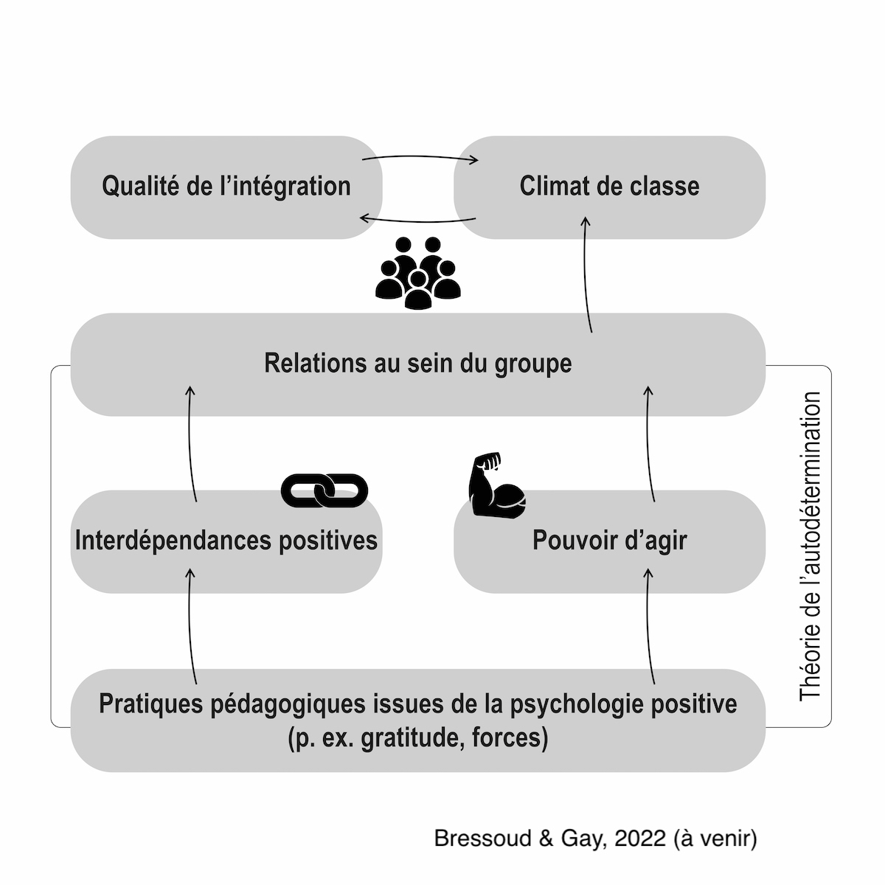

```{r setup, include=FALSE}
options(htmltools.dir.version = FALSE)
knitr::opts_chunk$set(
  fig.width=9, fig.height=3.5, fig.retina=3,
  out.width = "100%",
  cache = FALSE,
  echo = FALSE,
  message = FALSE, 
  warning = FALSE,
  fig.show = TRUE,
  hiline = TRUE
)
```

```{r xaringan-themer, include=FALSE, warning=FALSE}
library(xaringanthemer)
style_duo_accent(
  primary_color = "#D2202B",
  secondary_color = "#D2202B",
  inverse_header_color = "#FFFFFF",
  link_color = "#676C72",
    header_font_google = google_font("Josefin Sans")

)
```

class: title-slide, inverse, bottom
background-image: url(`r rmarkdown::metadata$url_unsplash`)
background-size: cover

# `r rmarkdown::metadata$title`

## `r rmarkdown::metadata$subtitle`

### `r rmarkdown::metadata$author` - `r rmarkdown::metadata$team`

### `r rmarkdown::metadata$date`

<p xmlns:cc="http://creativecommons.org/ns#" xmlns:dct="http://purl.org/dc/terms/"><a property="dct:title" rel="cc:attributionURL" href="https://bresnico.github.io/phd-8-avril-2022/#1">Les slides de présentation</a> par <a rel="cc:attributionURL dct:creator" property="cc:attributionName" href="https://nicolasbressoud.ch">Nicolas Bressoud</a> sont soumises à une licence <a href="http://creativecommons.org/licenses/by-nc/4.0/?ref=chooser-v1" target="_blank" rel="license noopener noreferrer" style="display:inline-block;">CC BY-NC 4.0</a></p>

---
class: left middle

### Titre
Approche pédagogique basée sur les **forces personnelles** des élèves et développement du **climat de classe** : perspectives en contexte d'**inclusion scolaire**

--

### Mots-clés
Forces de caractère (ressources, forces personnelles), Climat de classe, Inclusion scolaire

--


### Structure

1. Contexte
1. Question de recherche et hypothèses
1. Méthode
1. Résultats envisagés
1. Divers
1. Prochaines étapes

---
class: title-slide, inverse, middle
background-image: url("https://images.unsplash.com/photo-1469474968028-56623f02e42e?ixlib=rb-1.2.1&ixid=MnwxMjA3fDB8MHxwaG90by1wYWdlfHx8fGVufDB8fHx8&auto=format&fit=crop&w=2948&q=80")
background-size: cover

# Contexte

---
class: left middle

# Contexte


### Terrain scolaire romand

- Enseignement en classes hétérogènes
- Développement des mesures renforcées de l'enseignement spécialisé

--

### Thème prometteur

- Forces de caractère [(Peterson & Seligman, 2004)](https://psycnet.apa.org/record/2004-13277-000)
- Utilisation des forces (identifier, utiliser, promouvoir) [(Linkins et al., 2015)](https://www.tandfonline.com/doi/abs/10.1080/17439760.2014.888581)

--

### Impact relevé / potentiel

- Bénéfices pour les relations dans la classe [(Quinlan et al., 2014)](https://www.tandfonline.com/doi/abs/10.1080/17439760.2014.920407)
- Impact sur les affects positifs, le bien-être, la satisfaction de vie [(Schutte & Malouff, 2018)](https://link.springer.com/article/10.1007/s10902-018-9990-2)
- **Impact potentiel en contexte inclusif sur la qualité de vie, le besoin d'affiliation, le comportement prosocial,...)**

---
class: middle, center

### Prise de recul sur le fonctionnement possible

```{r out.width = '45%', echo=FALSE}
# local

```

[(Bressoud & Gay, 2022)](https://szh-shop.faros.ch/cms/Artikel-Detail/67565?itemID=REV2022_03)


---
class: left

# Contexte

### Champ de la pédagogie spécialisée

--

- Inclusion scolaire [(Prud'Homme, Duchesne, Bonvin, & Vienneau, 2016)](https://www.deboecksuperieur.com/ouvrage/9782807302747-l-inclusion-scolaire)

- Climat de classe [(Bennacer, 2005)](https://journals.openedition.org/osp/409)
 <!-- le climat d’une organisation est la perception globale qu’ont ses membres d’une série de caractéristiques générales, relativement stables, des interactions sociales qui se produisent dans cette organisation ». -->
- Indicateurs éventuels du climat de classe (perception des interactions sociales) : 

   - Echelle de bonheur subjectif [(Kotsou & Leys, 2017)](https://psycnet.apa.org/record/2017-00704-001)
   - Qualité des relations entre pairs (conceptogramme) [Voir la notion d'influence des pairs chez Müller, Cillessen, & Hoffmann (2021)](https://reader.elsevier.com/reader/sd/pii/S0193397321000903?token=14A2F7BFD66D78954F9E18CE5AB098676D804D570A035A967811D7CB08195228088FE02FD0681814D5CB115F8F268517&originRegion=eu-west-1&originCreation=20220402092604)
   - Echelle d'orientation reconnaissante [(Shankland, 2019)](https://www.cairn.info/la-psychologie-positive--9782100793235-page-157.htm)
  

--

### Lien avec les forces de caractère

- Développement récent dans le handicap [(Niemiec, Shogren, & Wehmeyer, 2017)](https://eric.ed.gov/?id=EJ1129568)

- Perspectives futures dessinées en inclusion scolaire [(Wehmeyer & Kurth, 2021)](https://wwnorton.com/books/9781324015994)

---
class: title-slide, inverse, middle
background-image: url("https://images.unsplash.com/photo-1581574919402-5b7d733224d6?ixlib=rb-1.2.1&ixid=MnwxMjA3fDB8MHxwaG90by1wYWdlfHx8fGVufDB8fHx8&auto=format&fit=crop&w=2940&q=80")
background-size: cover

# Question de recherche et hypothèses

---
class: left middle

# Question de recherche et hypothèses


### Deux sous-questions

- Peut-on enseigner l'utilisation des forces en classe ?

- Quel impact a l'utilisation des forces sur le climat de classe ?

--

### Hypothèses

- L'utilisation des forces à l'école peut être développée avec un programme pédagogique de 10 séances de 30 min. 

- L'utilisation des forces prédit :

    - l'orientation reconnaissante
    - le bonheur subjectif
    - la qualité des relations entre pairs
    - ...en tant qu'indicateurs du climat de classe

---
class: title-slide, inverse, middle
background-image: url("https://images.unsplash.com/photo-1555949963-ff9fe0c870eb?ixlib=rb-1.2.1&ixid=MnwxMjA3fDB8MHxwaG90by1wYWdlfHx8fGVufDB8fHx8&auto=format&fit=crop&w=2940&q=80")
background-size: cover

# Méthode

---
class: left middle

# Méthode


- Type de recherche
- Participants
- Design
- Matérial et éthique

---
class: left middle

# Méthode - Type de recherche


Design quasi-expérimental :

--

- Mesures répétées avant/après intervention (within subjects)

- Comparaison groupe contrôle / expérimental (between subjects)

- Tirage au sort des classes

---
class: left middle

# Méthode - Participants

--

- Population: élèves

- Age: 8 à 12 ans

- Type de scolarisation : principalement en scolarisation ordinaire

- N: 120 à 160 participant·es, 8 classes (4 dans chaque groupe)


---
class: left middle

# Méthode - Design

--
.pull-left[

## Partie A

### Variable dépendante

- Strengths use scale [(Govindji & Linley, 2007)](https://psycnet.apa.org/record/2007-19806-004)

### Variables indépendantes

- Temps
- Groupe

]

--

.pull-left[

## Partie B

### Variables dépendantes

- Orientation reconnaissante
- Bonheur subjectif
- Qualité des relations entre pairs

### Variable indépendante 

- Strengths use scale [(Govindji & Linley, 2007)](https://psycnet.apa.org/record/2007-19806-004)

]

---
class: left middle

# Méthode - Matériel et éthique

--

### Matériel

- Groupe expérimental :

    - Utilisation du matériel pédagogique par les enseignant·es (10 x 30 min)
    - 2 sessions par semaine sur 5 semaines
    - Coaching par l'expérimentateur (1 fois avant et 2 fois pendant la procédure)

- Mesures avant et après intervention dans les groupes contrôle et expérimental

--

### Aspects éthiques

- Approbation par une commission d'éthique
- Anonymisation
- Approbation par le SE de l'Etat du Valais

---
class: title-slide, inverse, middle
background-image: url("https://images.unsplash.com/photo-1520004434532-668416a08753?ixlib=rb-1.2.1&ixid=MnwxMjA3fDB8MHxwaG90by1wYWdlfHx8fGVufDB8fHx8&auto=format&fit=crop&w=2940&q=80")
background-size: cover

# Résultats - Attendus

---
class: left middle

# Résultats - Attendus

Une analyse multiniveaux pourrait indiquer

- une progression de l'utilisation des forces dans le groupe expérimental sur le temps comparativement au groupe contrôle

Une analyse corrélationnelle pourrait indiquer

- une prédiction de l'orientation reconnaissante, du bonheur subjectif, de la qualité des relations entre pairs par l'utilisation des forces.


---
class: title-slide, inverse, middle
background-image: url("https://images.unsplash.com/photo-1623503664086-475867ec20b3?ixlib=rb-1.2.1&ixid=MnwxMjA3fDB8MHxwaG90by1wYWdlfHx8fGVufDB8fHx8&auto=format&fit=crop&w=3173&q=80")
background-size: cover

# Divers

---
class: left middle

# Divers

- Collaborations:

    - HEP Valais
    - UniDistance
    - UNIFR
    - HEP Vaud
    - Université Lyon Lumière
    
- Conflits d'intérêt : aucun

---
class: title-slide, inverse, middle
background-image: url("https://images.unsplash.com/photo-1518623001395-125242310d0c?ixlib=rb-1.2.1&ixid=MnwxMjA3fDB8MHxwaG90by1wYWdlfHx8fGVufDB8fHx8&auto=format&fit=crop&w=2880&q=80")
background-size: cover

# Prochaines étapes

---
class: left middle

# Prochaines étapes

### avril-mai : accord éthique
### août-novembre : Récolte des données

- Semaine 1: T0
- Semaines 2 à 7: Intervention
- Semaine 8: T1

---
class: title-slide, inverse, middle
background-image: url("https://images.unsplash.com/photo-1633613286848-e6f43bbafb8d?ixlib=rb-1.2.1&ixid=MnwxMjA3fDB8MHxwaG90by1wYWdlfHx8fGVufDB8fHx8&auto=format&fit=crop&w=2940&q=80")
background-size: cover

# Questions ouvertes

---
class: left middle

# Questions ouvertes


- Est-ce que la théorie de l'autodétermination consolide le projet ?

- Comment obtenir des mesures valides ?

---

class: middle

.left[


## &#x1F64F; Merci !

]

--

.right[


Crédits Photo par ordre d'apparition :

[Med Badr Chemmaoui](hhttps://unsplash.com/photos/ZSPBhokqDMc)

[David Marcu](https://unsplash.com/photos/78A265wPiO4)

[Engin Akyurt](https://unsplash.com/photos/bPiuY2ZSlvU)

[Shahadat Rahman](https://unsplash.com/photos/BfrQnKBulYQ)

[Kelly Sikkema](https://unsplash.com/photos/4JxV3Gs42Ks)

[Mats Hagwall](https://unsplash.com/photos/uzl47XdoLww)

[Vidar Nordli-Mathisen](https://unsplash.com/photos/Kuu5mmxkwW4)

[Towfiqu barbhuiya](https://unsplash.com/photos/oZuBNC-6E2s)

]
